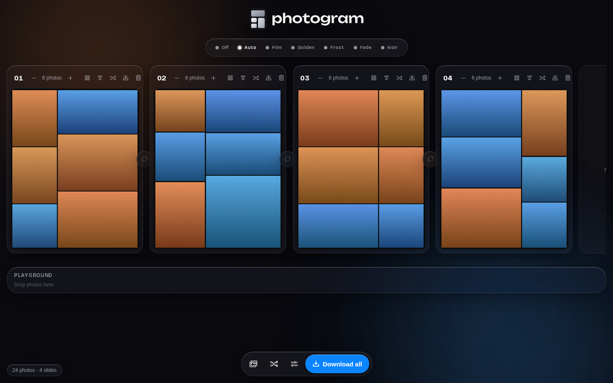
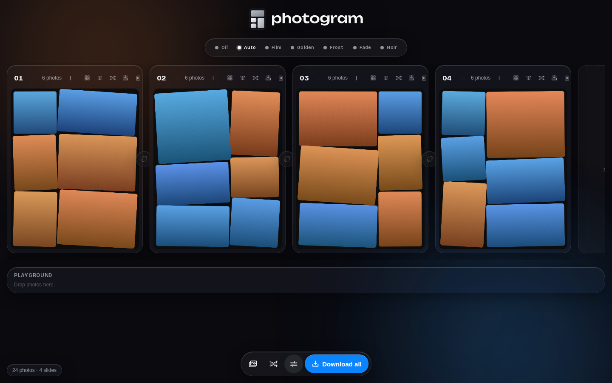
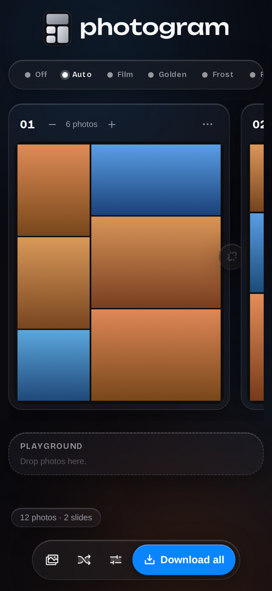

<p align="center"></p>

Dump your camera roll in, get finished Instagram carousel slides back. I made this because every collage app I tried either stops at one image or wants money to place 20 photos.

Everything runs in your browser. Photos never leave your device.

[**Try it here.**](https://gitter499.github.io/ihavealotofphotostopostandphotocollagemakersarealleitherdumboraripoffsoclaudeismakingoneforme/)





## What it does

- Sorts photos by time and lays them out. No photo limit, no watermark, no account, no server.
- 31 layout templates — grids, magazine heroes, filmstrips, polaroid tosses — pinned per slide, with the automatic composer as default. ([How it compares](docs/PARITY.md).)
- Smart crops: each photo's subject is found on-device (saliency, in a worker) and crops follow it.
- Captions per slide, set in display type over a soft scrim, baked into exports.
- Slides break at natural time gaps. A standout shot gets a slide to itself.
- Spots burst duplicates so only the best one gets a big slot.
- Nudges similar colours onto the same slide.
- Filters with live preview bubbles, and an Off switch when they miss. The strip folds into a dot row when you're not choosing.
- A Remix button that regroups everything under a different idea each press: colour runs, light arcs, hero shots anchoring slides, lookalikes split apart.
- Tilt, rounded corners, gutter width, stroke borders, 4:5 / 1:1 / 9:16.
- Mesh: tap the link chip between two slides and a photo runs across the seam, so the carousel swipes as one continuous strip. Each seam is its own switch; the options can set them all at once.
- Tap any photo and a slider pops up to resize it — the rest of the slide reflows around it.
- Drag photos between slides or within one. Add, delete, reorder slides. Set any slide's photo count.
- A playground shelf under the slides: park photos there while you experiment, drag them back when you're sure. Regroup and remix leave parked photos alone.
- Exports numbered 1440×1800 JPEGs in a zip, ready to post in order.

## Run it

```
npm install
npm run dev
```

Tests: `npm test` and `npm run test:e2e`.

## On your phone

The site installs as an app — Share → Add to Home Screen on iPhone, the
install prompt on Android — and works offline after the first visit.

For real native builds, Capacitor projects are checked in:

```
npm run build && npx cap sync
npx cap open ios       # needs a Mac with Xcode
npx cap open android   # needs Android Studio
```
