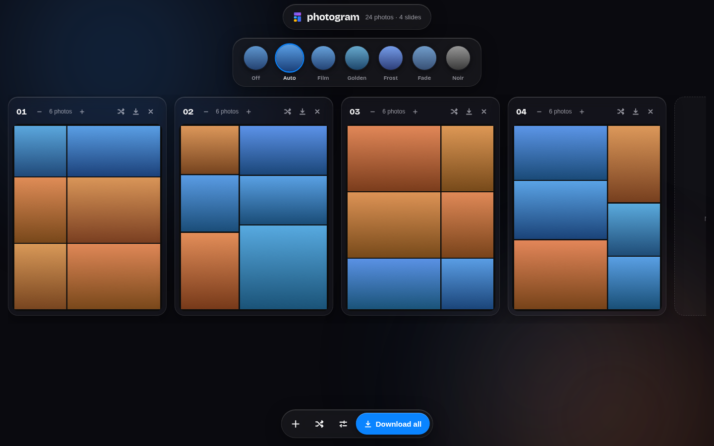
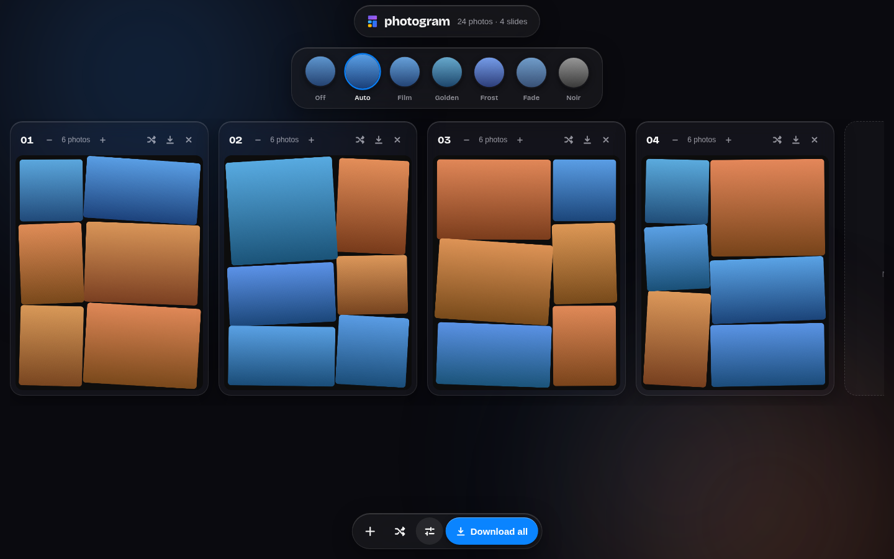

<p align="center"></p>

Dump your camera roll in, get finished Instagram carousel slides back. I made this because every collage app I tried either stops at one image or wants money to place 20 photos.

Everything runs in your browser. Photos never leave your device.

[**Try it here.**](https://gitter499.github.io/ihavealotofphotostopostandphotocollagemakersarealleitherdumboraripoffsoclaudeismakingoneforme/)




## What it does

- Sorts photos by time and lays them out. No photo limit, no watermark.
- Slides break at natural time gaps. A standout shot gets a slide to itself.
- Spots burst duplicates so only the best one gets a big slot.
- Nudges similar colours onto the same slide.
- Filters with live preview bubbles, and an Off switch when they miss.
- Tilt, rounded corners, gutter width, 4:5 or 1:1.
- Drag photos between slides or within one. Add, delete, reorder slides. Set any slide's photo count.
- Exports numbered 1440×1800 JPEGs in a zip, ready to post in order.

## Run it

```
npm install
npm run dev
```

Tests: `npm test` and `npm run test:e2e`.
